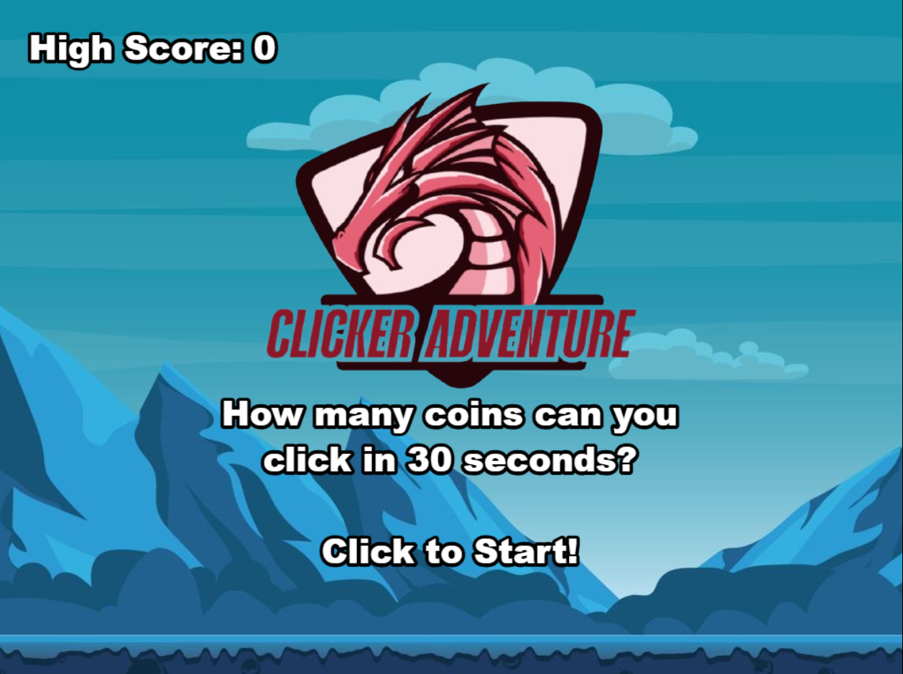

# Clicker Adventure

This is a simple coin clicker game. The goal is to click the coin as many times as possible in the time limit.

## Instructions

1. Clone the repository.
2. Install dependencies with `npm install`.
3. Start the development server with `npm run dev`.
4. If you want to build the project, run `npm run build`.

## Changes

1. This work is based in the Demo Game of Phaser: Coin Clicker
2. Only uses the phaser and vite modules

## Warnings

1. The github deploy don't work

